# Minh Chứng Hình Ảnh

> Đề tài có hai đóng góp tách biệt. Hình ảnh Đóng góp 1 minh họa kiến trúc PGA-UNet và kết quả phân đoạn thuần túy. Hình ảnh Đóng góp 2 minh họa pipeline lâm sàng hoàn chỉnh.  
> Tất cả ảnh nằm trong thư mục `images/` (25 file PNG).

---

## Tổng Quan Ảnh

| File | Đóng góp | Nhóm | Nội dung |
|---|---|---|---|
| `diagram_pga.png` | 1 | Kiến trúc | PGA-UNet với PSG + CAD |
| `diagram_unet.png` | 1 | Kiến trúc | U-Net baseline |
| `diagram_attunet.png` | 1 | Kiến trúc | Attention U-Net |
| `diagram_sammed2d.png` | 1 | Kiến trúc | SAM-Med2D (ViT-B + Adapter) |
| `vis_pga_1.png` | 1 | Kết quả PGA | IMG001768 — Zoom-out vs Shift |
| `vis_pga_2.png` | 1 | Kết quả PGA | IMG001538 — Pipeline cứu hộ GradCAM+IPR |
| `vis_pga_3.png` | 1 | Kết quả PGA | IMG001100 — Tổn thương lớn |
| `vis_sam_1.png` | 1 | So sánh SAM | IMG001768 — 3 kịch bản |
| `vis_sam_2.png` | 1 | So sánh SAM | IMG001538 — hạn chế 256px |
| `vis_unet_1.png` | 1 | So sánh baseline | U-Net — over-segmentation |
| `vis_unet_2.png` | 1 | So sánh baseline | U-Net — mẫu bổ sung |
| `vis_attunet_1.png` | 1 | So sánh baseline | Attention U-Net — attention khuếch đại nhiễu |
| `vis_attunet_2.png` | 1 | So sánh baseline | Attention U-Net — mặt nạ lệch hoàn toàn |
| `ablation_v1_visualization.png` | 1 | Ablation | V1 (Concat) — 10 mẫu test |
| `ablation_v2_visualization.png` | 1 | Ablation | V2 (PSG only) — 10 mẫu test |
| `ablation_v3_visualization.png` | 1 | Ablation | V3 (CAD only) — 10 mẫu test |
| `ablation_v4_visualization.png` | 1 | Ablation | V4 (Full + Binary bbox) — 10 mẫu test |
| `system_architecture.png` | 2 | Hệ thống | Sơ đồ tổng thể 4 giai đoạn pipeline |
| `preprocessing_pipeline.png` | 2 | Hệ thống | Quy trình tiền xử lý 6 bước |
| `classification_evaluation.png` | 2 | Phân lớp | Confusion matrix + ROC AUC=0.9514 |
| `gradcam_ipr_rescue_1.png` | 2 | GradCAM Rescue | 174 mẫu câu nhắc sai — nhóm 1 |
| `gradcam_ipr_rescue_2.png` | 2 | GradCAM Rescue | 174 mẫu câu nhắc sai — nhóm 2 |
| `defense_pga_rescue_vis.png` | 2 | So sánh phòng vệ | PGA GradCAM rescue vs Ground Truth |
| `defense_sam_dark_corner.png` | 2 | So sánh phòng vệ | SAM-Med2D câu nhắc góc tối — không có cứu hộ |
| `app_interface.png` | 2 | Ứng dụng | Giao diện Gradio end-to-end |

---

# PHẦN I — ĐÓNG GÓP 1: Kiến Trúc PGA-UNet

## A. Sơ Đồ Kiến Trúc

### A.1 Kiến trúc PGA-UNet đề xuất
**File:** `images/diagram_pga.png`

Minh họa hai thành phần đóng góp chính:
- **Prompt Spatial Gate (PSG):** tích hợp bản đồ nhiệt câu nhắc vào bộ mã hóa qua phép nhân có chọn lọc
- **Conditioned Attention Decoder (CAD):** điều kiện hóa tín hiệu gating bằng câu nhắc tại từng tầng giải mã, trọng số giảm dần

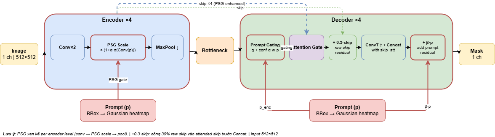

### A.2 Kiến trúc U-Net cơ sở
**File:** `images/diagram_unet.png`

Nền tảng encoder-decoder đối xứng với kết nối tắt — cả 4 mô hình đều dựa trên kiến trúc này.

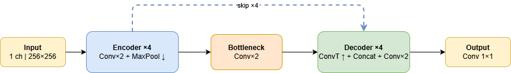

### A.3 Kiến trúc Attention U-Net
**File:** `images/diagram_attunet.png`

Cổng chú ý (Attention Gate) tại kết nối tắt — tiền đề cho Conditioned Attention của PGA-UNet.

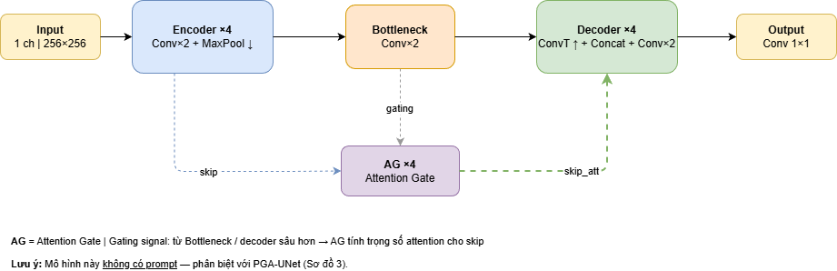

### A.4 Kiến trúc SAM-Med2D (mô hình so sánh)
**File:** `images/diagram_sammed2d.png`

ViT-B Image Encoder + Adapter layers + Mask Decoder — ~100M tham số, fine-tune từ 4M+ ảnh y tế.

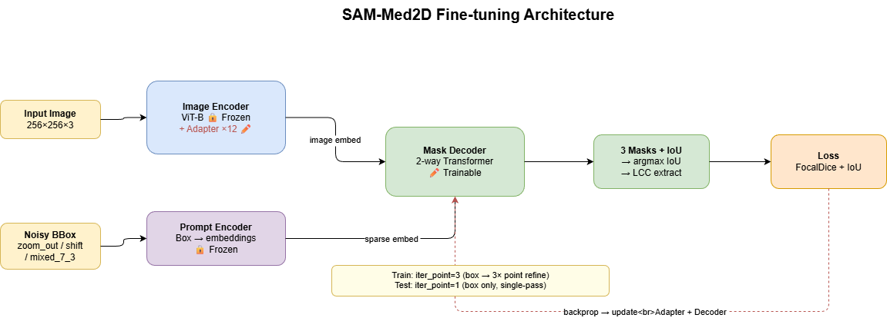

---

## B. Kết Quả Phân Đoạn — PGA-UNet

### B.1 Mẫu IMG001768 (Kịch bản Zoom-out và Shift)
**File:** `images/vis_pga_1.png`

Hàng trên: Zoom-out (câu nhắc lý tưởng) — Hàng dưới: Shift (câu nhắc lệch tâm).  
Các cột: Ảnh gốc | Prompt heatmap | Ground Truth | Dự đoán | Overlay.  
Minh chứng tính bền bỉ: Dice giảm nhẹ từ 0.8606 (Zoom-out) xuống 0.8380 (Shift) — chỉ −2.6%.

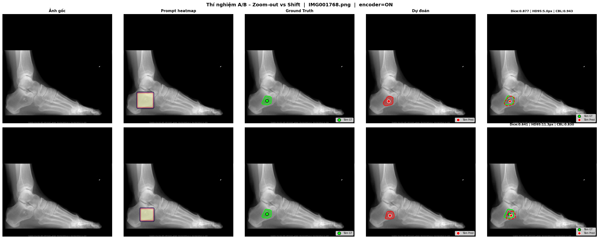

### B.2 Mẫu IMG001538 (Pipeline cứu hộ GradCAM + IPR)
**File:** `images/vis_pga_2.png`

Minh họa chuỗi hành động khi câu nhắc hoàn toàn sai vị trí:
1. Phát hiện → từ chối → kích hoạt GradCAM
2. GradCAM trích xuất điểm neo cứu hộ
3. IPR vòng 1 → mặt nạ thô bám vùng tổn thương
4. IPR vòng 2 → mặt nạ hội tụ, bám sát Ground Truth

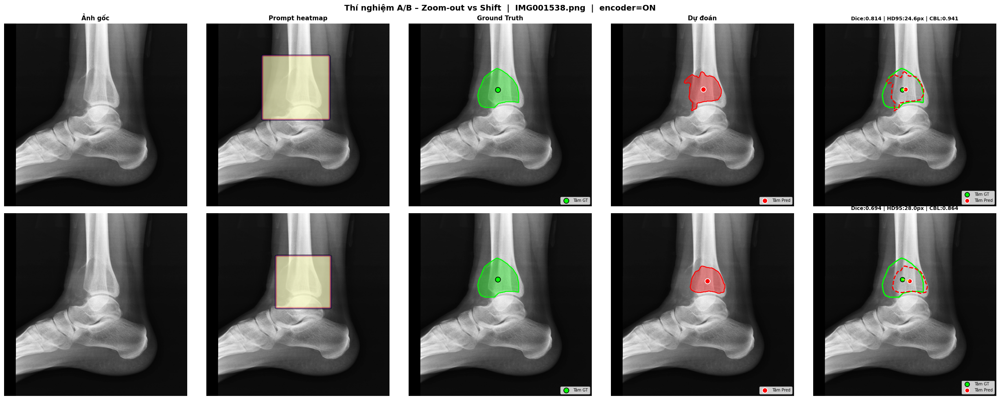

### B.3 Mẫu IMG001100 (Tổn thương lớn vùng đùi)
**File:** `images/vis_pga_3.png`

PGA-UNet phân đoạn chính xác tổn thương lớn ở cả kịch bản Zoom-out và Shift.

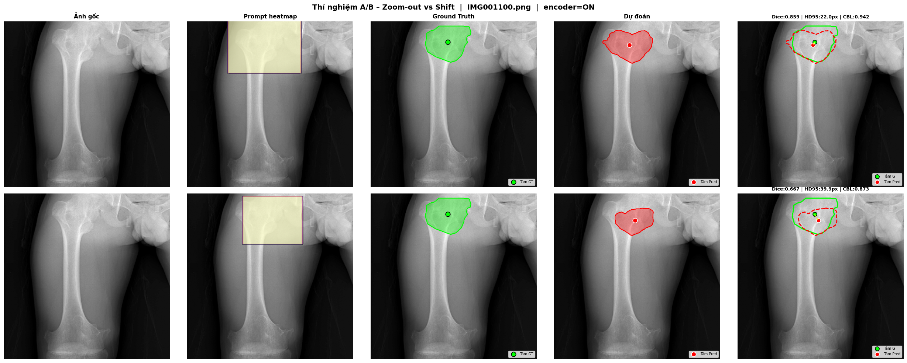

---

## C. So Sánh Với SAM-Med2D

### C.1 Mẫu IMG001768 — 3 kịch bản prompt
**File:** `images/vis_sam_1.png`

3 hàng: Zoom-out / Shift / Mixed 70/30 — 4 cột: Bbox prompt | Ground Truth | SAM prediction | Overlay.  
Dice(Zoom-out)=0.7624, Dice(Shift)=0.7273 — thấp hơn PGA ở cả 3 kịch bản.

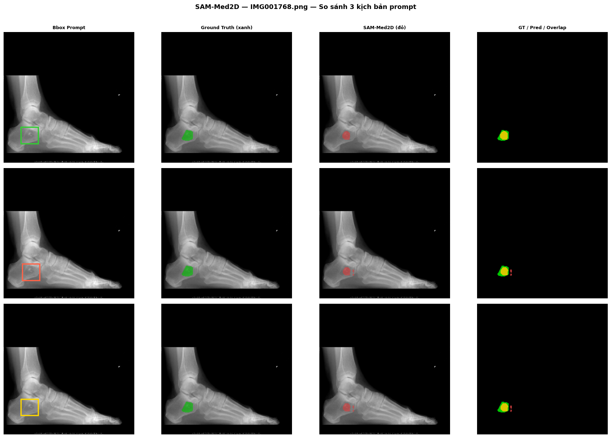

### C.2 Mẫu IMG001538 — Hạn chế độ phân giải 256×256
**File:** `images/vis_sam_2.png`

Minh chứng hạn chế của SAM-Med2D trên cấu trúc xương nhỏ: tổn thương bị mờ, bỏ sót nhiều ở độ phân giải 256px.

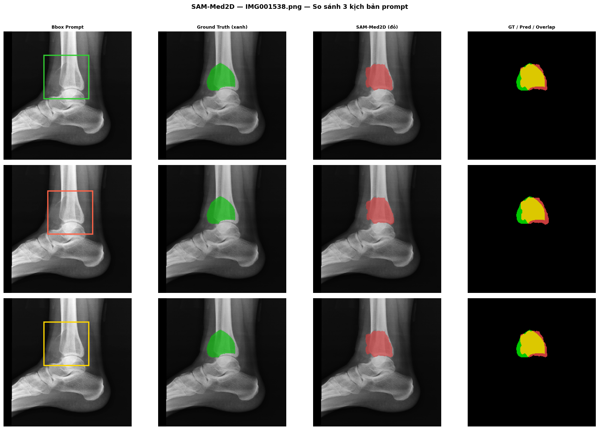

---

## D. So Sánh Với Baseline (U-Net, Attention U-Net)

### D.1 U-Net — Phân đoạn sai khi không có câu nhắc
**File:** `images/vis_unet_1.png` và `images/vis_unet_2.png`

Minh họa hiện tượng over-segmentation và nhầm lẫn cấu trúc xương khi mô hình tự tìm kiếm vùng tổn thương không có hướng dẫn.

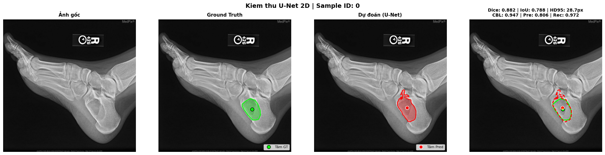

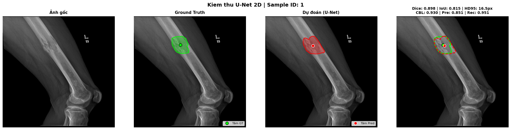

### D.2 Attention U-Net — Attention khuếch đại nhiễu
**File:** `images/vis_attunet_1.png` và `images/vis_attunet_2.png`

Attention Gate khuếch đại sai vùng (thiết bị cố định xương, bờ khớp) khi không có tín hiệu định hướng — dẫn đến Dice thấp hơn cả U-Net cơ sở.

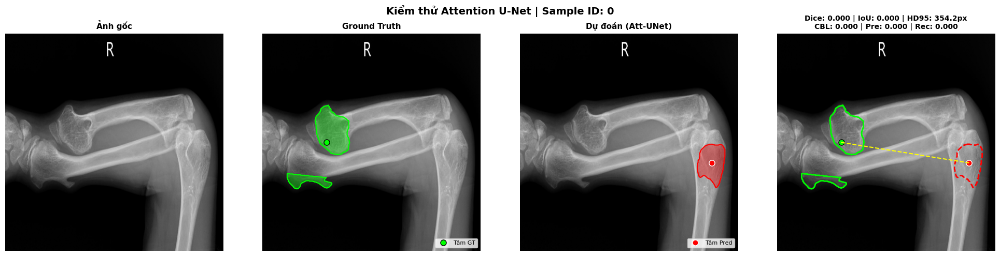

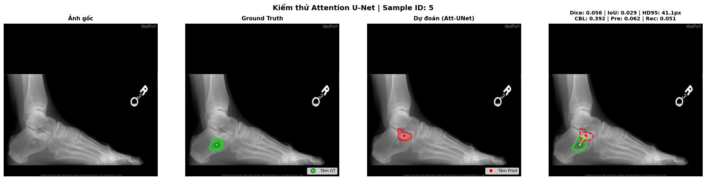

---

## E. Ablation — Visualization Kiến Trúc V1–V4

> Mỗi ảnh hiển thị 10 mẫu test đầu (kịch bản Zoom-out). 5 cột: Ảnh gốc | Ảnh + Prompt | Dự đoán | Ground Truth | TP/FP/FN.  
> Số liệu chi tiết tại **02_Minh_Chung_So_Lieu — Mục C**.

### E.1 V1 — Concat đơn giản (không PSG, không CAD)
**File:** `images/ablation_v1_visualization.png`

Heatmap nối thêm kênh ảnh (2 kênh đầu vào), decoder U-Net thường. Dice zoom_out=0.8722 — baseline mạnh, cho thấy tín hiệu câu nhắc đơn giản đã giúp đáng kể.

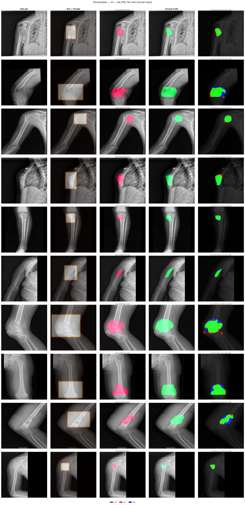

### E.2 V2 — Chỉ PSG (không CAD)
**File:** `images/ablation_v2_visualization.png`

PromptSpatialGate ở encoder, decoder U-Net thường. Dice zoom_out=0.8707 — PSG đơn lẻ nhỉnh hơn V1 không đáng kể, encoder dẫn hướng tốt nhưng decoder chưa được điều kiện hóa.

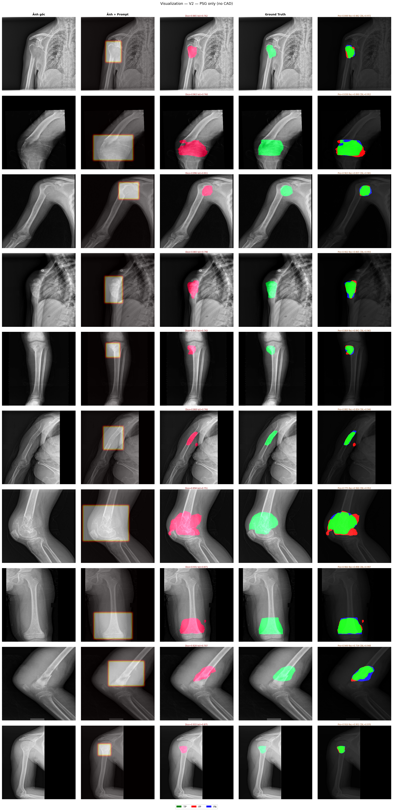

### E.3 V3 — Chỉ CAD (không PSG)
**File:** `images/ablation_v3_visualization.png`

Encoder U-Net thường + ConditionedAttentionDecoder. Dice zoom_out=0.8864 — CAD đơn lẻ đạt cao nhất trong 4 biến thể ablation, attention decoder có tác động mạnh hơn PSG ở encoder.

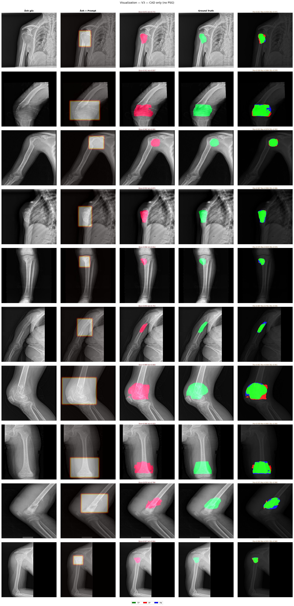

### E.4 V4 — PSG + CAD, câu nhắc Binary bbox
**File:** `images/ablation_v4_visualization.png`

Kiến trúc đầy đủ nhưng dùng bbox nhị phân thay heatmap. Dice zoom_out=0.8802 — kết hợp PSG+CAD tốt hơn từng thành phần riêng lẻ. Kém hơn V5 (Heatmap) ở kịch bản Shift (+5.6pp), chứng minh Plateau Heatmap giúp mô hình bền vững với prompt nhiễu.

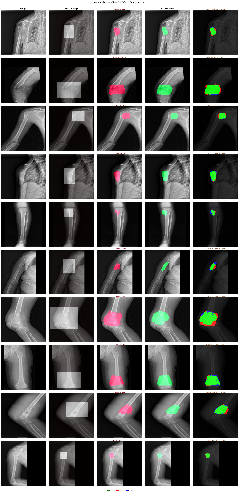

---

# PHẦN II — ĐÓNG GÓP 2: Pipeline Lâm Sàng

## F. Sơ Đồ Hệ Thống & Tiền Xử Lý

### F.1 Kiến trúc pipeline 4 giai đoạn
**File:** `images/system_architecture.png`

Luồng xử lý end-to-end: Tiền xử lý (YOLOv11 xóa nhiễu) → Sàng lọc (MobileNetV4) → Phân đoạn có hướng dẫn (PGA-UNet) → Thẩm định an toàn (GradCAM + IPR). Minh họa cả hai kịch bản: câu nhắc hợp lệ (luồng thường) và câu nhắc sai (luồng cứu hộ).

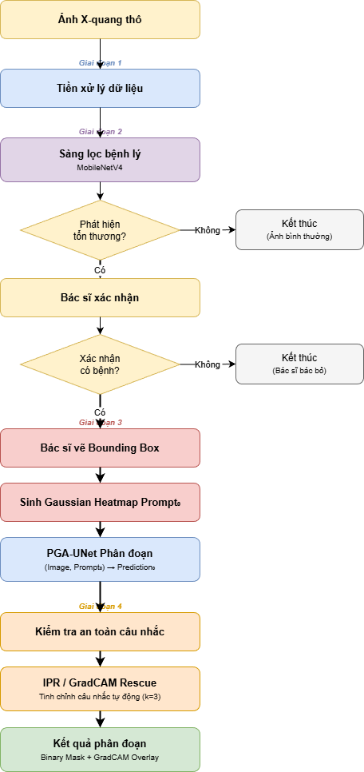

### F.2 Quy trình tiền xử lý 6 bước
**File:** `images/preprocessing_pipeline.png`

Từ ảnh JPEG thô → xóa ICC Profile → gán nhãn nhiễu trên Roboflow → huấn luyện YOLOv11s → phát hiện và xóa nhiễu R/L bằng inpainting → chuẩn hóa thang xám → resize 512×512.

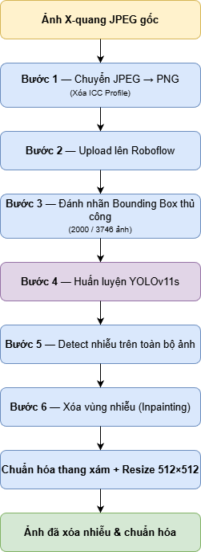

---

## G. Kết Quả Phân Loại Sàng Lọc (MobileNetV4)

**File:** `images/classification_evaluation.png`

Bao gồm: (a) Ma trận nhầm lẫn, (b) Đường cong ROC (AUC=0.9514), (c) Phân phối xác suất dự đoán.

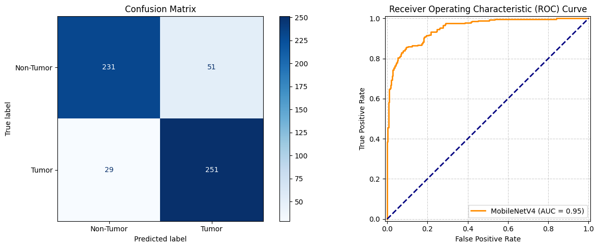

---

## H. Cơ Chế Phòng Vệ GradCAM + IPR

### H.1 GradCAM Rescue — Các mẫu thực nghiệm
**File:** `images/gradcam_ipr_rescue_1.png` và `images/gradcam_ipr_rescue_2.png`

Kết quả thực nghiệm trên 174 mẫu câu nhắc sai hoàn toàn (đặt vào góc tối ≥70% đen). Mỗi hàng là một mẫu, hiển thị: ảnh gốc + câu nhắc sai | bản đồ nhiệt GradCAM | mặt nạ sau IPR k=1 | Ground Truth. Minh chứng trực quan cho tỷ lệ phát hiện 100% và cơ chế cứu hộ bán tự động.

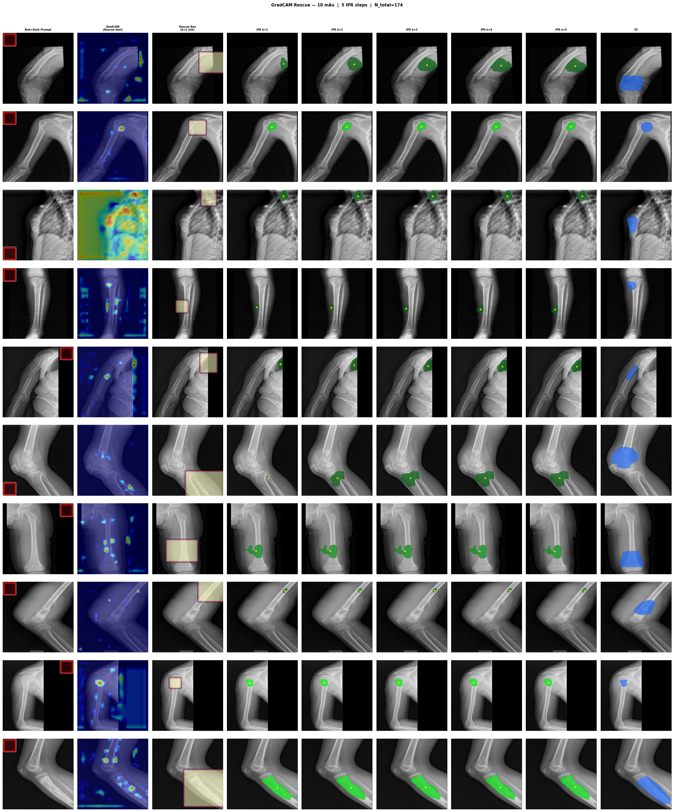

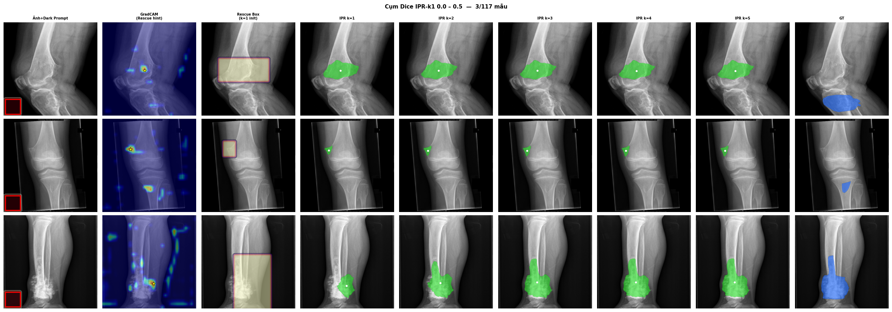

### H.2 So sánh phòng vệ: PGA vs SAM-Med2D
**File:** `images/defense_pga_rescue_vis.png`

PGA-UNet khi nhận câu nhắc góc tối: từ chối → GradCAM → IPR → xuất mặt nạ gợi ý. Kết quả GradCAM CBL=0.298, cứu hộ thành công 21.8% ca.

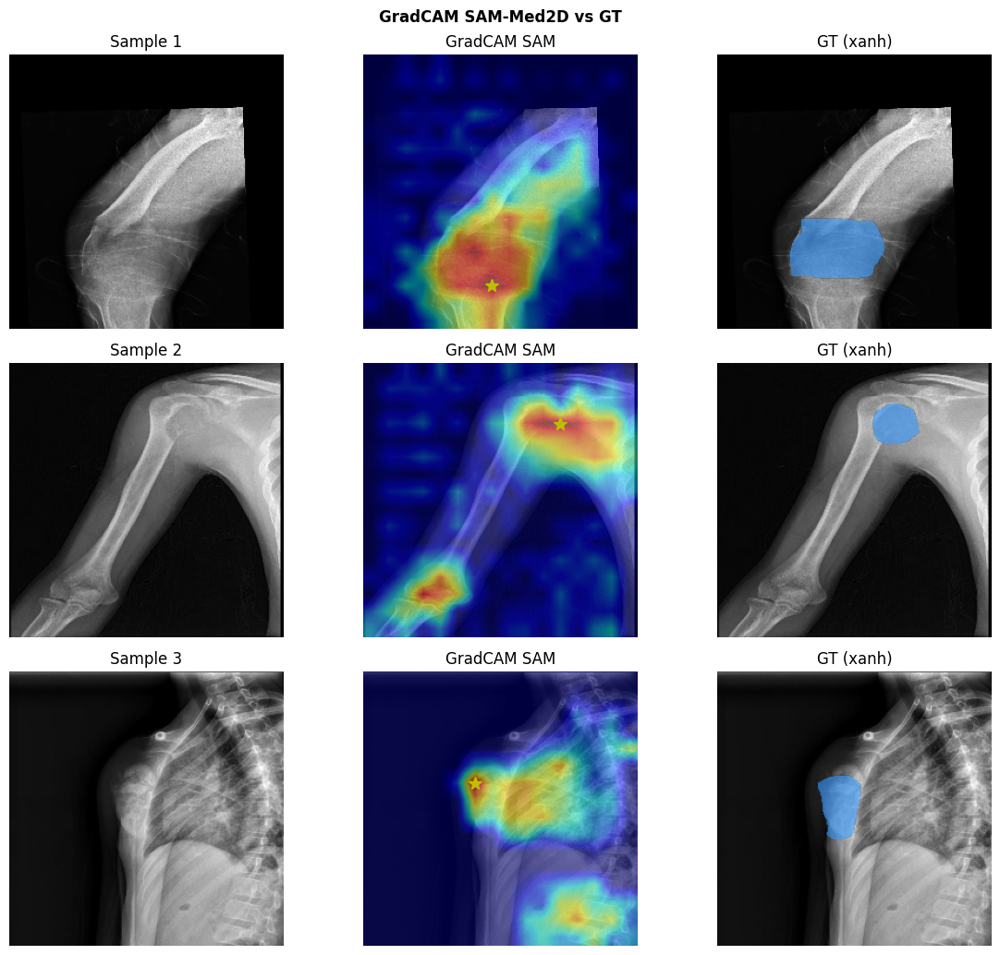

**File:** `images/defense_sam_dark_corner.png`

SAM-Med2D khi nhận **cùng câu nhắc góc tối**: không có kiểm duyệt, trả về mặt nạ sai im lặng. GradCAM CBL=0.497 (tốt hơn PGA về định vị) nhưng **không có pipeline cứu hộ tích hợp** — đây là khoảng trống mà Đóng góp 2 lấp đầy.

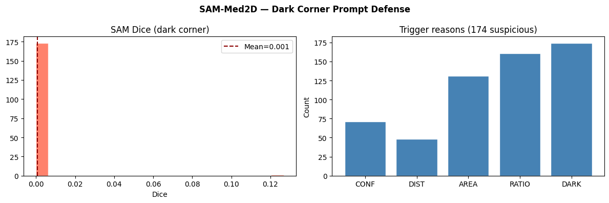

---

## I. Ứng Dụng Tích Hợp

### I.1 Giao diện Gradio (app.py)
**File:** `images/app_interface.png`

Giao diện end-to-end: bác sĩ tải ảnh X-quang → MobileNetV4 phân lớp tự động → vẽ hộp giới hạn → PGA-UNet phân đoạn → hiển thị mặt nạ kèm bản đồ nhiệt GradCAM. Kịch bản câu nhắc sai: hệ thống tự động hiển thị "Mặt nạ gợi ý" song song.

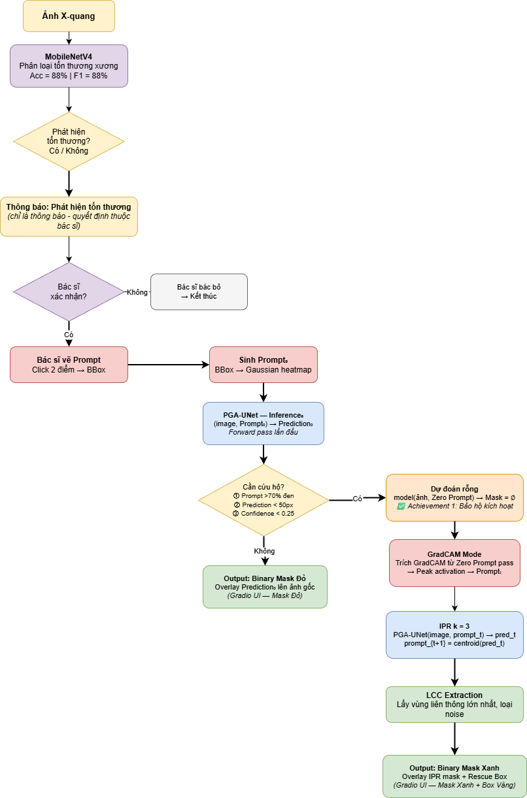
